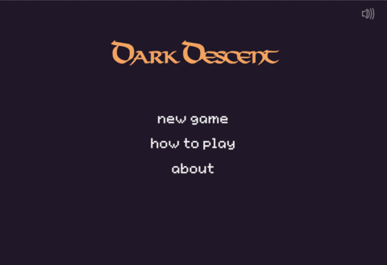

# Dark Descent
[Live Game][dark-descent]

[dark-descent]: https://edwinla.github.io/dark-descent/

Dark Descent is a rogue-like dungeon crawler written in pure JavaScript without any external libraries. It utilizes procedural generation to create a new map with each descent, allowing the player to explore limitless different corridors and rooms to fight enemy creatures. SASS and Webpack were used for bundling stylesheets and modules respectively.

## Features and Implementation

Players are able to quickly navigate through the menu options as each screen is pre-loaded as a part of the DOM as soon as the page loads and event listeners are bound to each menu option (as an overlay modal) for fast CSS display toggling.

The game's map is drawn by the native canvas API available to plain JavaScript. Player interfaces such as the HUD, main menu, and events log represent the HTML DOM and are dynamically changed as the player interacts with his environment.

### Procedural Generation

The main `game` class holds a procedurally generated `floor` as the player is able to clear the level and find the pit to the next depth. Each `floor` class generates a random number of `room` instances of varying sizes. Rooms are then connected via a `path` class that uses A* pathfinding in conjunction with a `BinaryMinHeap` data structure to for fast lookup (of the shortest path).

Since the map tiles used restrained the type of traversable terrain for the player, gap-filling and wall-placement algorithms were additionally used to ensure that each floor was free of visual bugs.

## Future Directions
- Animated battles using JavaScript's `requestAnimationFrame`
- Enemy movement based on player proximity and pathfinding algorithm
- Inventory slots and on-click item usage
- Story-driven; with friendly NPCs with interactive dialogue
