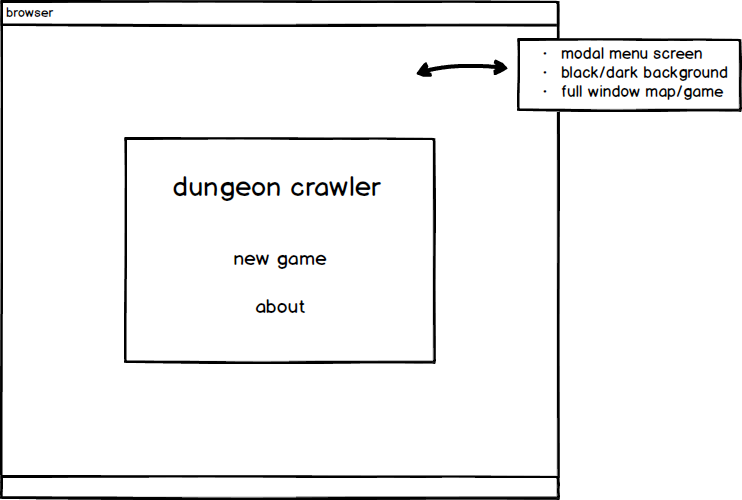
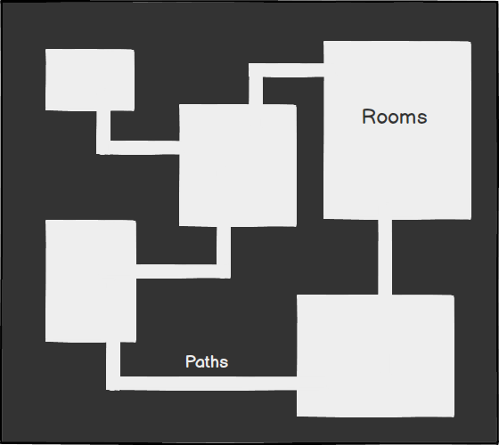
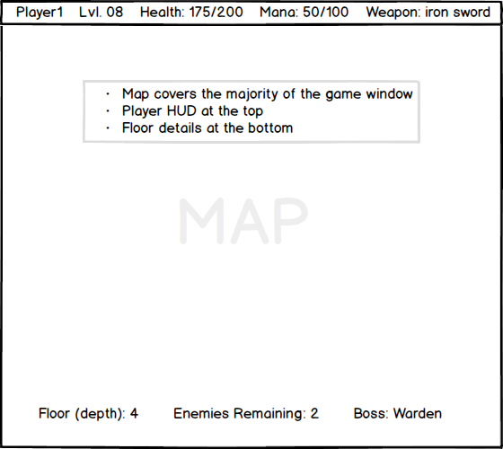

# Torrey Pines

## Background
Silver Moon is a rogue-like dungeon crawler with the possibility of unlimited levels and high replay value due to procedural generation of each depth/floor.

The game is built on vanilla JavaScript without any external libraries and works on any browser that supports requestAnimationFrame.

## Functionality & MVP

With Silver Moon, players will be able to:

- [ ] Start a new game
- [ ] Procedural-generated content
- [ ] Move their character
- [ ] Encounter and fight enemies
- [ ] Pick up new weapons

In addition, this project will include:

- [ ] A main menu allowing the user to:
  * Start a new game
  * Read the game rules
  * Display the about page

- [ ] A production README

## Wireframes

## Architecture and Technologies

This project will be implemented with the following technologies:

- Vanilla JavaScript for overall structure and game logic,
- Webpack to bundle and serve up the various scripts.

## Classes

`game.js`: this class will handle the main game logic, including creating a new game.

`partition.js`: this class will handle the logic behind generating a 'partition' of each procedurally-generated floor. Partitions randomly assign itself as a 'room-spawner' on instantiation and are pieced together in the main game glass.

`pathfinder.js`: this script uses A* pathfinding to draw corridors between rooms and uses a flood-fill algorithm to ensure that no rooms are inaccessible

`character.js`: this class contains the barebones functions required for any character to move and contain attributes

`enemy.js, player.js`: inherits from character

### Implementation Timeline

**Day 1**:

- Setup npm and webpack
- Render grid onto canvas
- Procedurally-generate partitions/rooms

**Day 2**:

- Connect rooms via pathfinding algorithm
- Optimize partition-map-pathfinding generation

**Day 3**:

- Create base character class
- Enable character movement
  * Enable on-keypress functionality
  * Sync visual animation frames with data structures

**Day 4**:

- Create inherited player and enemy classes
- Implement battle system

**Day 5**:

- Add level/depth change on event
- Finalize sprite/tileset
- Add 'continue' modals in between each floor

**Day 6**
- Add 'how-to' and 'about' screens to main menu

### Bonus features

There are many directions this cellular automata engine could eventually go.  Some anticipated updates are:

- [ ] Sound that can be toggled on/off
- [ ] Full-window mode
- [ ] Mobile friendly
- [ ] Story-driven
